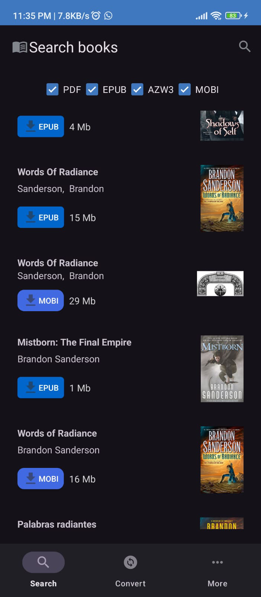
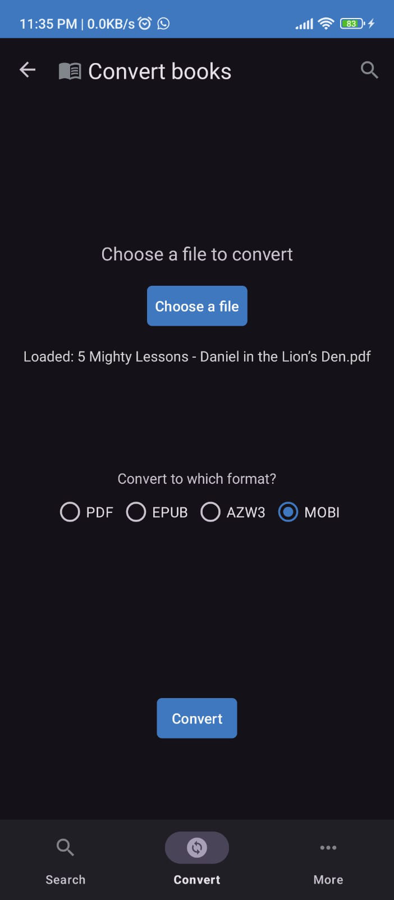

  

<h1 align=center>Alexandria</h1>

Alexandria is an open source application for downloading and converting EBooks.

Follow me on Twitter at [@aloussase](https://x.com/aloussase) for updates on this app's development!

**Features**

- Search for your favorite titles and download them
- Can't find your favorite book in the right format? No problem, builtin EBook converter

**Anti-features**

- Uses some non-free sources for downloading books. Specifically, Alexandria uses Libgen.
  Libgen is considered a [shadow library](https://en.wikipedia.org/wiki/Shadow_library).
- Uses a custom-made proprietary API for converting books from one format to another. I will
  consider open-sourcing this once it's mature enough.

## Install from F-droid

Download the F-droid app from [their website](https://f-droid.org/) and search for Alexandria.

## Screenshots

  
  

## Contributing

Think you can make Alexandria better? Feel free to open an issue or PR about it!

## Support

All and any support is much appreciated! I you'd like to, you
can <a href="https://ko-fi.com/aloussase" target="_blank">buy be a cola</a>.

## License

MIT
